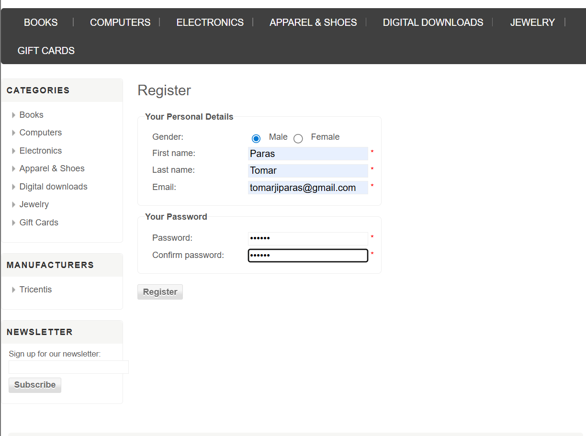
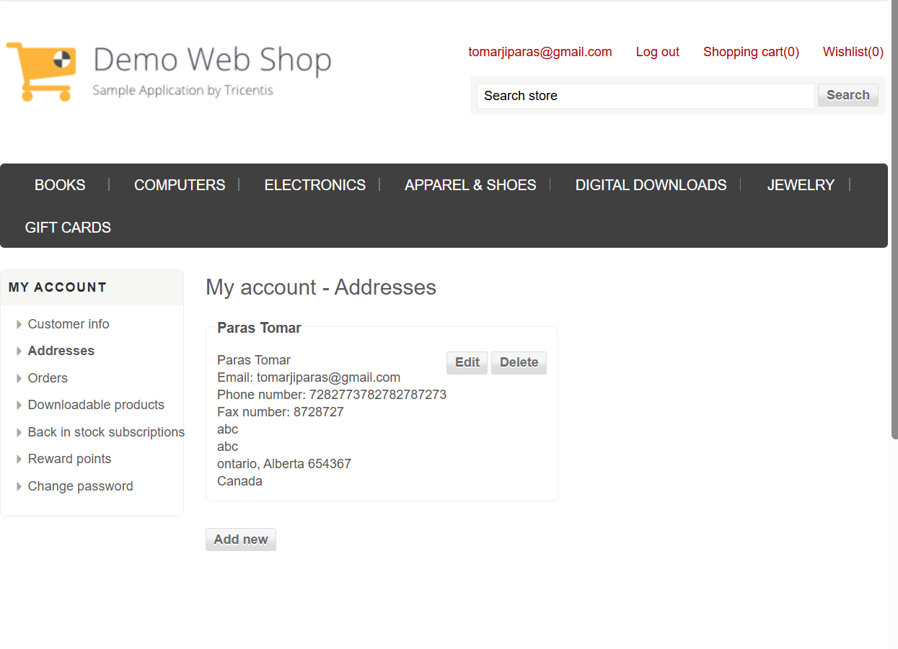
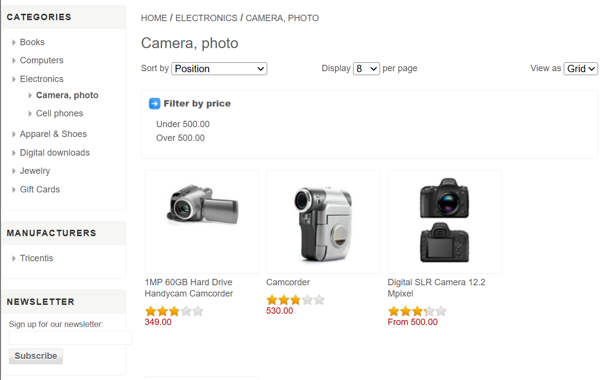
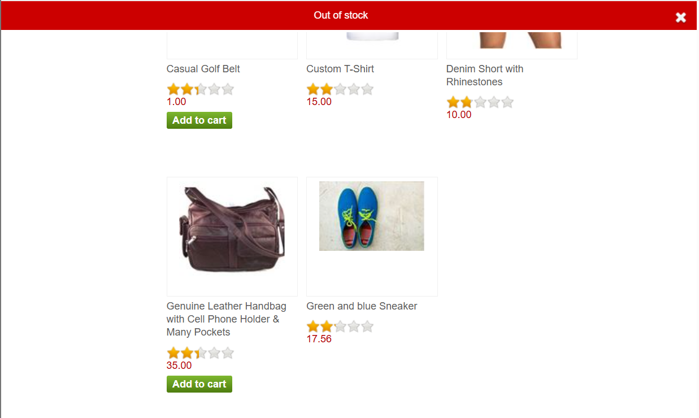
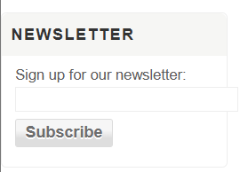
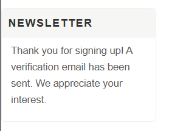
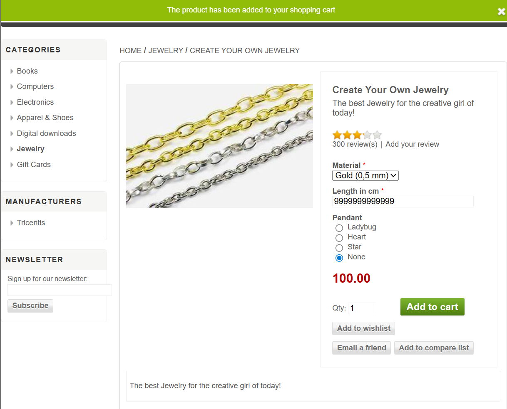
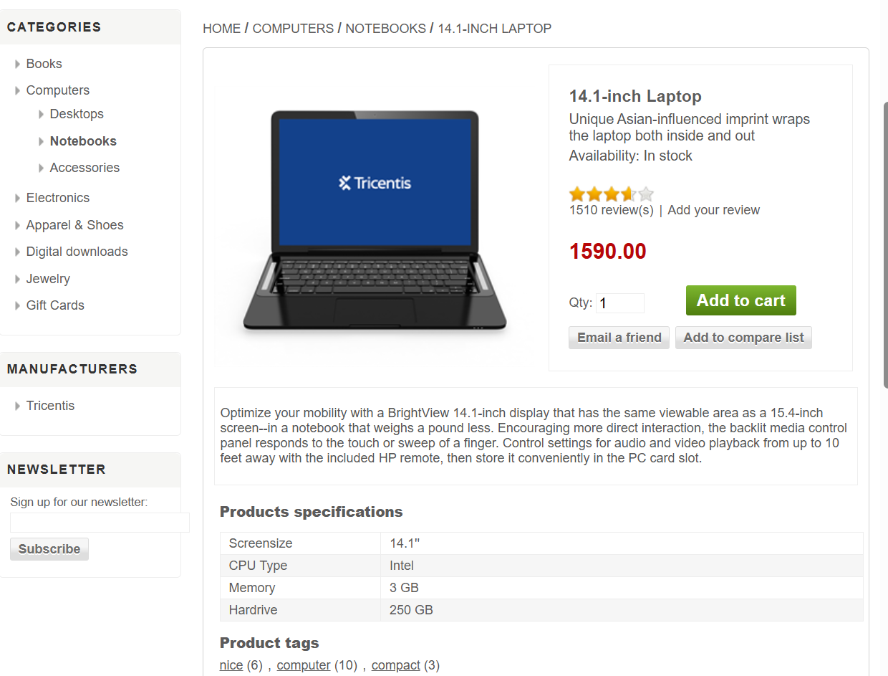
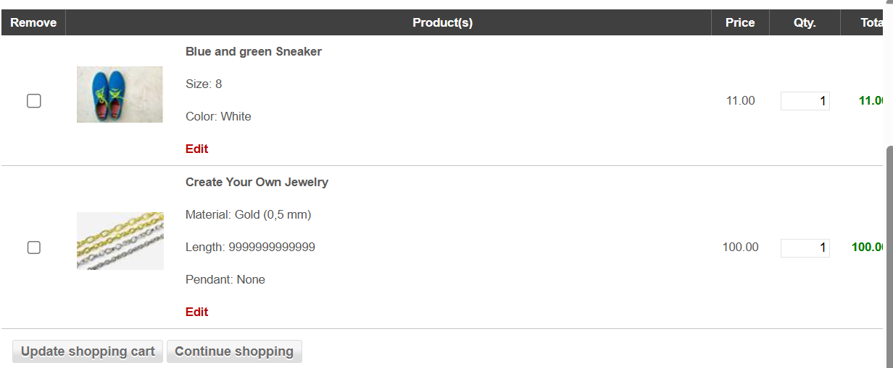
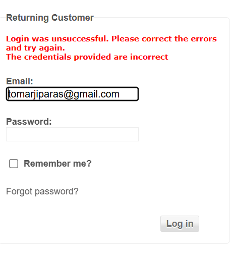

#  Demo Web Shop – Bug Report Document

##  Project: Demo Web Shop Testing

##  Tester: Paras Tomar

##  Environment: Web Application (Browser-based)

##  Testing Type: Manual Testing

#  Bug Summary

* Total Bugs Identified: **10**

#  Bug Details

## BUG_001 – Weak Password Validation

**Module:** Registration
**Severity:** Medium
**Priority:** High

**Description:**
System accepts weak passwords consisting only of special characters.

**Steps to Reproduce:**

1. Go to Register page
2. Enter valid user details
3. Enter password as `@@@@@@`
4. Confirm password and submit

**Expected Result:**
Password should enforce complexity rules

**Actual Result:**
Weak password is accepted

Screenshot:
 

## BUG_002 – Missing Validation in Billing Address

**Module:** Checkout
**Severity:** High
**Priority:** High

**Description:**
Billing address fields accept invalid inputs (random text/numbers without validation).

**Steps to Reproduce:**

1. Add any product to cart
2. Proceed to checkout
3. Enter invalid values (e.g., random text in phone, invalid zip)
4. Continue checkout

**Expected Result:**
Proper validation for each field

**Actual Result:**
System accepts invalid inputs

Screenshot:

## BUG_003 – Missing “Add to Cart” for Camera Products

**Module:** Product Listing
**Severity:** High
**Priority:** High

**Description:**
Camera category products do not have purchase option.

**Steps to Reproduce:**

1. Navigate to Electronics → Camera & Photo
2. Observe product listings

**Expected Result:**
Each product should have Add to Cart or Buy option

**Actual Result:**
No purchase option available

Screenshot:

## BUG_004 – Out-of-Stock Not Displayed Before Action

**Module:** Product Listing
**Severity:** Medium
**Priority:** Medium

**Description:**
Products show “Add to cart” but display “Out of stock” only after clicking.

**Steps to Reproduce:**

1. Navigate to product (e.g., Leather Handbag)
2. Click “Add to cart”

**Expected Result:**
Out-of-stock status should be displayed before user action

**Actual Result:**
Message shown only after clicking

Screenshot:

## BUG_005 – Newsletter Field Lacks Input Guidance

**Module:** Newsletter
**Severity:** Low
**Priority:** Medium

**Description:**
Newsletter input field does not indicate required input type.

**Steps to Reproduce:**

1. Navigate to homepage
2. Locate Newsletter section
3. Observe input field

**Expected Result:**
Field should show placeholder like “Enter your email”

**Actual Result:**
No input guidance provided

Screenshot:

## BUG_006 – Misleading Newsletter Success Message

**Module:** Newsletter
**Severity:** Low
**Priority:** Medium

**Description:**
System shows email sent message without actual email delivery.

**Steps to Reproduce:**

1. Enter valid email in newsletter field
2. Click Subscribe
3. Observe success message
4. Check email inbox

**Expected Result:**
Email should be received OR message should reflect demo behavior

**Actual Result:**
Message shown but no email received

Screenshot:

## BUG_007 – Product Length Field Accepts Unrealistic Values

**Module:** Product (Jewelry)
**Severity:** Medium
**Priority:** Medium

**Description:**
Length input field accepts extremely large values.

**Steps to Reproduce:**

1. Navigate to “Create Your Own Jewelry”
2. Enter very large value (e.g., 9999999999)
3. Click Add to cart

**Expected Result:**
Input should be restricted within valid range

**Actual Result:**
Product added with invalid value

Screenshot:

## BUG_008 – Missing Wishlist Button in Product Detail

**Module:** Product Page
**Severity:** Medium
**Priority:** Medium

**Description:**
Wishlist option missing on certain product detail pages.

**Steps to Reproduce:**

1. Navigate to product page (e.g., Laptop)
2. Observe available options

**Expected Result:**
Wishlist option should be present

**Actual Result:**
Wishlist option missing

Screenshot:

## BUG_009 – UI/UX Issue in Cart Removal Flow

**Module:** Cart
**Severity:** Low
**Priority:** Low

**Description:**
Cart removal process is not intuitive.

**Steps to Reproduce:**

1. Add product to cart
2. Select remove checkbox
3. Observe behavior without clicking update

**Expected Result:**
Item removal should be intuitive or clearly guided

**Actual Result:**
Requires additional action without clear indication

Screenshot:

## BUG_010 – Login Error Message Reveals Information

**Module:** Login
**Severity:** High
**Priority:** High

**Description:**
Different error messages are shown for invalid email and wrong password, allowing user enumeration.

**Steps to Reproduce:**

1. Enter invalid email and attempt login
2. Observe error message
3. Enter valid email with wrong password
4. Observe error message

**Expected Result:**
Same generic error message should be displayed

**Actual Result:**
Different messages are shown

Screenshot:

#  Final Notes

* Bugs include:

  * Functional Issues
  * Validation Issues
  * UI/UX Issues
  * Security Issues

* Major impact areas:

  * Checkout
  * Product Purchase Flow
  * Authentication

